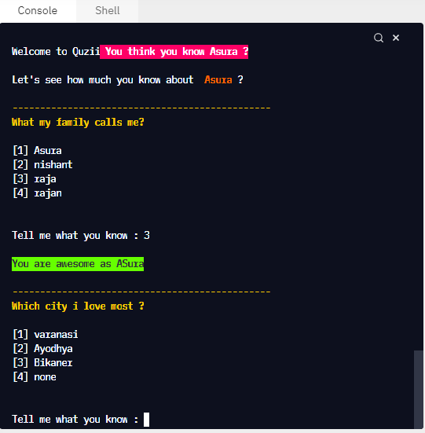

<h1>Quiz About myself</h1>

It is a quiz to check your knowledge about <b>Me </b>.

I used node.js readlinesync module to get the input from the terminal and use chalk package to give a colorful look to this CLI app.

> This project is part of neog.camp. It is markOne <b>CLI QUIZ APP</b>.

